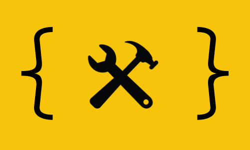

   

# lite-js-utils

Lot of methods to use in JS/TS applications.

# Why Lite JS Utils?

It is common in our JS / TS applications to install complete packages (moment, lodash ...) just to use some methods. The lite-js-utils project was created precisely to meet the need to install large packages just for the use of common methods. See the [full docs](http://docs) for a list of available methods.

# Readme Contents

* [Features/Docs](#rocket-features)
* [Installation](#construction_worker-installation)
* [Issues](#bug-issues)
* [Contributing](#tada-contributing)
* [License](#closed_book-license)

# Features/Docs

You can view the full documentation [here](https://docs).

# Installation

To install lite-js-utils, just run in your terminal:

`npm install lite-js-utils` or `yarn add lite-js-utils`

# Issues

Feel free to **create a new issue** with a respective title and description on the the [lite-js-utils](https://github.com/wesleymonaro/lite-js-utils/issues) repository. If you already found a solution to your problem, **you can make a pull request \o**

# Contributing

Let's make the project big? (not in package size :p)
Check the [contributing](https://github.com/wesleymonaro/lite-js-utils/blob/master/CONTRIBUTING.md) page to see the best places to file issues, start discussions and begin contributing.

# License

Released in 2020.
This project is under the [MIT license](https://github.com/wesleymonaro/lite-js-utils/blob/master/LICENSE).

Made with love in Mogi das Cruzes/SP by [Wesley Monaro](https://github.com/wesleymonaro)
